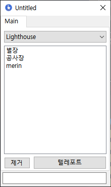

[Mod]: https://github.com/Untitled0828/Untitled0828/raw/main/Program/BetterTarkov/BetterTarkov.7z "파일 다운로드"
[NamedPipe]: https://ko.wikipedia.org/wiki/%EB%AA%85%EB%AA%85%EB%90%9C_%ED%8C%8C%EC%9D%B4%ED%94%84

# BetterTarkov.exe

SPT-AKI 2.3.1
BetterTarkov 모드가 있어야 작동합니다.

---

해당 프로그램은 클라이언트 사이트 모드 BetterTarkov와 [NamedPipe][NamedPipe]를 통해 데이터를 전송합니다.

방식을 구현하면서. 데이터를 확인하는 쓰레드의 cpu사용량이 너무 많아져서 처리하는 쓰레드에 딜레이를 넣어두엇습니다.

그래서 명령어 처리할때 0.x ~ 1초 정도 딜레이가 생길 수 있습니다.

* 구현된 인게임 명령어
  * tp [name] or tp (x) (y) (z)
    * 텔레포트 리스트중 [name] 의 위치로 텔레포트 합니다.
    * (x) (y) (z) 의 위치로 텔레포트 합니다.
  * tps [name]
    * 현재 좌표를 [name]으로 저장합니다.

* 구현된 프로그램 명령어
  * tp (x) (y) (z)
    * 프로그램상에서 해당 명렁어 입력시 해당 좌표로 텔레포트 합니다.

각 텔레포트 정보는 맵별로 저장됩니다.

* Documents\BetterTarkov\Teleport

* 사용시 유의할 점
  * EscapeFromTarkov와 연결된 이후 BetterTarkov.exe가 꺼진다면 게임을 재시작 해주셔야 다시 연결됩니다.
  * 만약 에러가 발생한다면. 무슨 행동이후 발생했는지 적어주신다면 버그를 수정하는데 도움이 됩니다.

---

## [BetterTarkov.exe Download][Mod]
